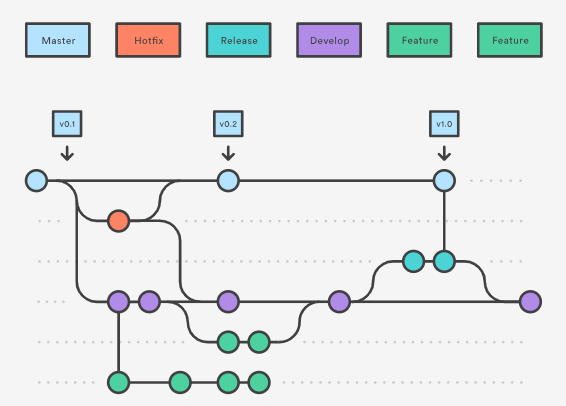

# git-analyzer-server

This is the project for my end of degree course. It is a github app that analyzes contributions via a github app.

## TODOS

This is a list of all the stuff I found neccessary or I would like to include in the project.

* Browserstack testing
* Karma testing
* Including React
* Webpack for reload at runtime while developing

## Gitflow

